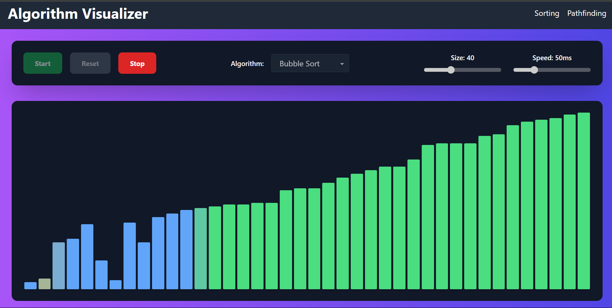
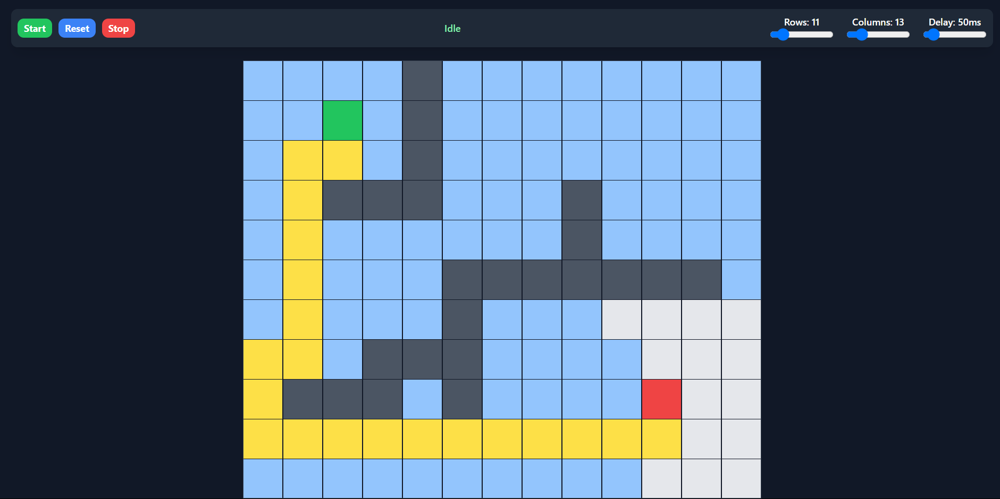

# AlgoViz

AlgoViz is an interactive visualization tool for sorting algorithms and pathfinding algorithms. It is built using React with Vite bundler and styled with Tailwind CSS. The project is frontend-only and provides a user-friendly interface to visualize various algorithms in action.

## Features

- Visualize various sorting algorithms including Bubble Sort and Quick Sort.
- Visualize pathfinding algorithms on a grid.
- Interactive controls to start, stop, and reset the visualizations.
- Adjustable size and speed for sorting and pathfinding visualizations.
- Modern, responsive UI built with Tailwind CSS.

## Screenshots

### Sorting Visualization

### Pathfinding Visualization

